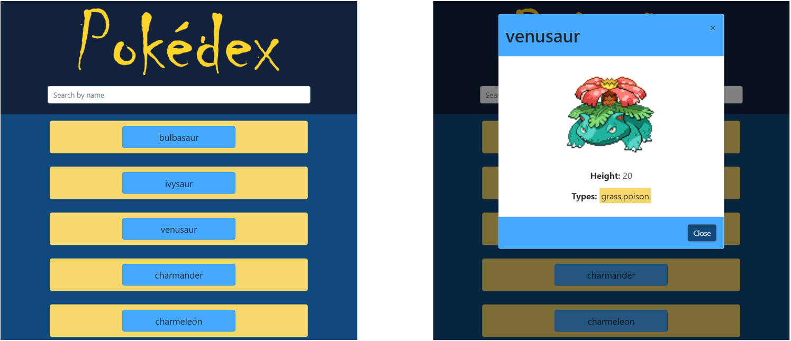

# A simple JavaScript App (Pokédex)

  
  

## About The Project

This is a basic responsive web application with HTML, CSS and JAVASCRIPT which loads data from an external API.

## Project dependencies:

This app is built based on ECMAScript2015(ES6).

## Technologies:

The following technologies are used:
- [PokéAPI](https://github.com/PokeAPI/pokeapi)
- [jQuery](https://jquery.com/)
- [Bootstrap](https://getbootstrap.com/)
- [Atom](https://atom.io/)
- [Prettier](https://prettier.io/)
- [ESLint](https://eslint.org/)

## API:
https://pokeapi.co/

## Project link:

https://github.com/hamedghd/simple-js-app
